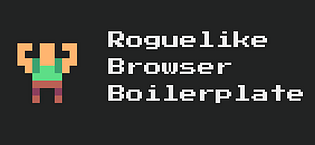
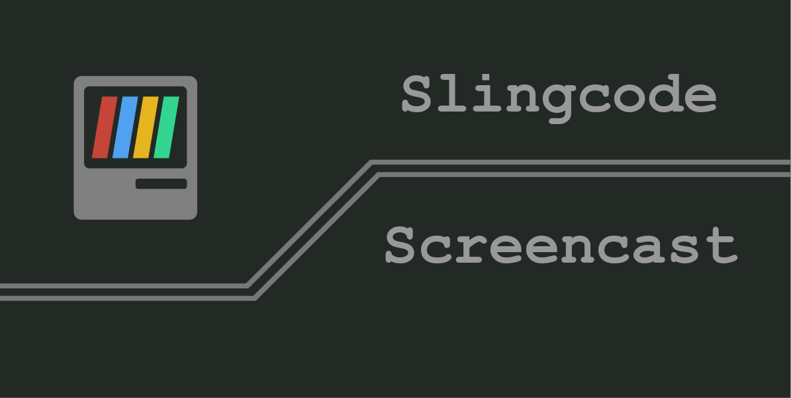

Hey there! My name is Chris and I really love writing code.

You can find me online:

 * [mccormick.cx](https://mccormick.cx)
 * [@mccrmx on Twitter](https://twitter.com/mccrmx)
 * [YouTube screencasts](https://www.youtube.com/user/mccormix)

Here are some things I've been working on recently:

  <a href="https://chr15m.itch.io/roguelike-browser-boilerplate">
     
    Want to make your own roguelike game? 
    Use this web app template to get a head start.
  </a>

  <a href="https://slingcode.net/">
     
    Slingcode is a beginner-friendly web based
    IDE and personal computing platform.
  </a>

  <a href="">
     
    px3d ClojureScript 3d game engine 
    with Blender live-reloading.
  </a>

<!--

-->
